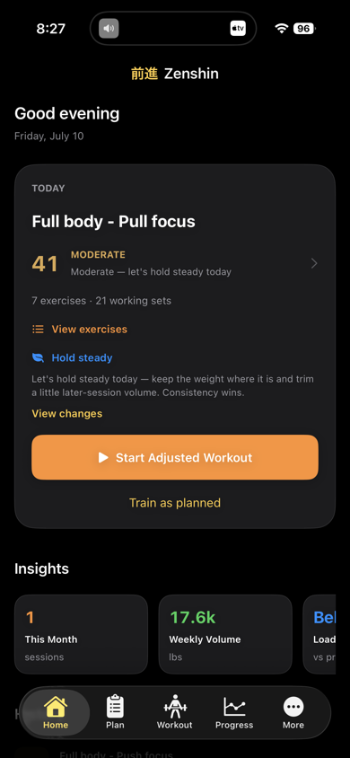
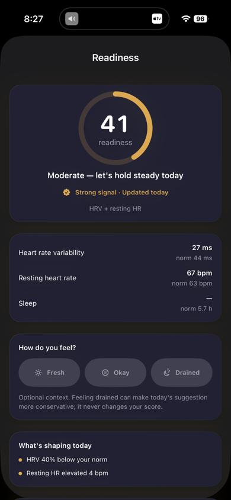
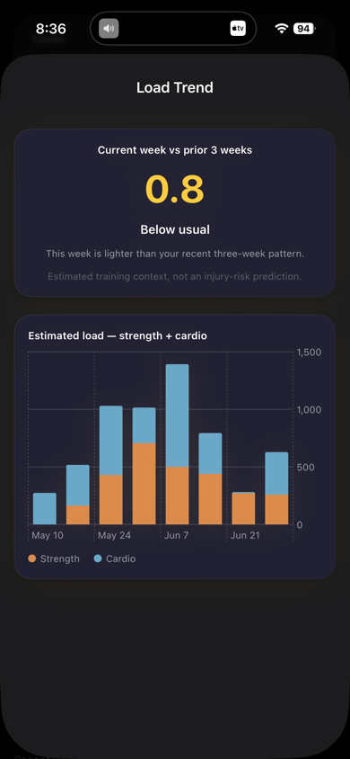
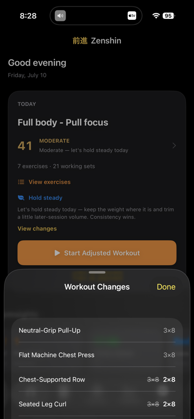

# Zenshin — time-series readiness and training-load engineering

Zenshin turns sparse, noisy recovery history into explainable daily guidance. Its calculation layer builds rolling personal baselines, redistributes missing-signal weights, reconstructs historical scores without looking ahead, and guards load trends until enough comparison data exists. This repository is a **curated, buildable engineering extract** of that deterministic time-series logic—not the production product repository.

[View Zenshin on the App Store](https://apps.apple.com/app/zenshin-strength-recovery/id6778892282) · [Product page](https://amitsapkota.me/zenshin/)



## What to inspect

- [`ReadinessEngine.swift`](Sources/ZenshinShowcase/ReadinessEngine.swift): rolling personal baselines, missing-signal weight redistribution, and no-look-ahead historical scoring.
- [`LoadEngine.swift`](Sources/ZenshinShowcase/LoadEngine.swift): strength/cardio aggregation and a guarded acute-to-typical load ratio.
- [`EngineTests.swift`](Tests/ZenshinShowcaseTests/EngineTests.swift): calibration, score direction, historical integrity, sparse-history, and trend-boundary tests.
- [`SOURCE_PROVENANCE.md`](SOURCE_PROVENANCE.md): exact production commit, original paths, and every adaptation made for this extract.

The production product ships on iPhone and Apple Watch. It keeps HealthKit ingestion, SwiftData persistence, workout planning, watch synchronization, and signing configuration private; recovery inputs and calculations stay on device.

## Run the package

```sh
swift test
```

Requires Swift 6. The package depends only on Foundation and XCTest.

## Screens

| Readiness | Hybrid load | Transparent changes |
|---|---|---|
|  |  |  |

## Use

The source is published for portfolio review. It is not an open-source grant; see [`LICENSE`](LICENSE).
